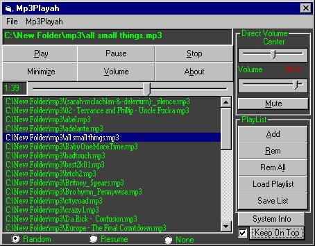



## A MP3 Player

### Description

It's A MP3 Player And has apart of the basic (Play, Stop, Pause) these functions: Add File Or Directory To Playlist, Remove (All) From Playlist, Load And Save Playlists, Keep On Top, Mute, System Info, Balance, Volume, Play: Random, Resume, Or stop after MP3 stopped. ProgressBar, Timer, Open Windows WaveTable... It aint finished,

mail me if you have any bug reports or if you have any suggestions. Thank You :-)
 
### More Info
 

             |
---                |---
**Submitted On**   |2000-04-20 23:03:26
**By**             |[Wauters Arne](https://github.com/Planet-Source-Code/PSCIndex/blob/master/ByAuthor/wauters-arne.md)
**Level**          |Beginner
**User Rating**    |4.0 (56 globes from 14 users)
**Compatibility**  |VB 5\.0, VB 6\.0
**Category**       |[Sound/MP3](https://github.com/Planet-Source-Code/PSCIndex/blob/master/ByCategory/sound-mp3__1-45.md)
**World**          |[Visual Basic](https://github.com/Planet-Source-Code/PSCIndex/blob/master/ByWorld/visual-basic.md)
**Archive File**   |[CODE\_UPLOAD50024202000\.zip](https://github.com/Planet-Source-Code/wauters-arne-a-mp3-player__1-7427/archive/master.zip)

### API Declarations

Some, Download n see :P

